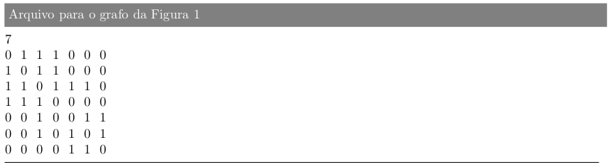

<h2>Project 2 - Graph Search</h2>

**Description**: In this project, you should implement, in any programming language, the
depth-first and breadth-first search algorithms. The program will read a undirected graph, simple and connected, which will be informed through a text file with a format
similar to the file from project 1. For the graph illustrated in Figure 1a, for example, the file from
entry would be as follows

